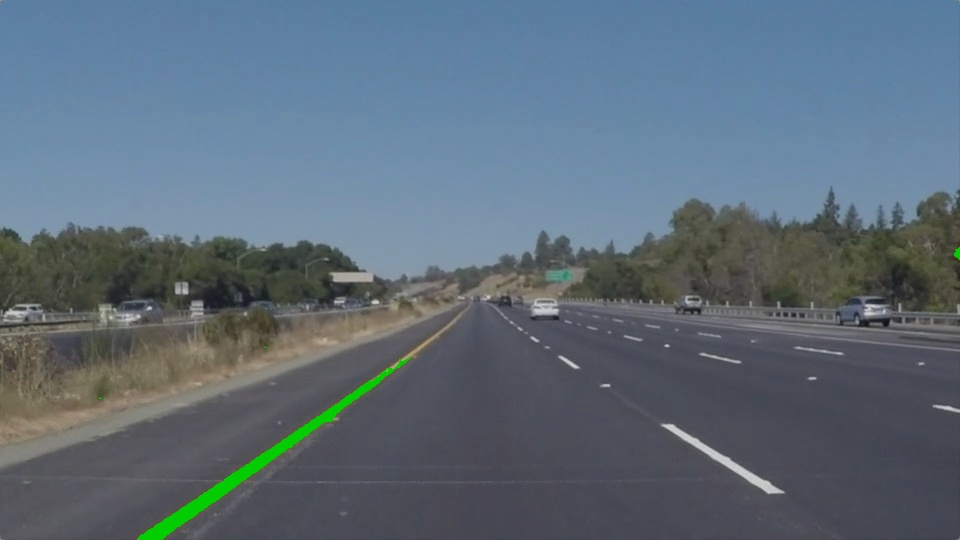
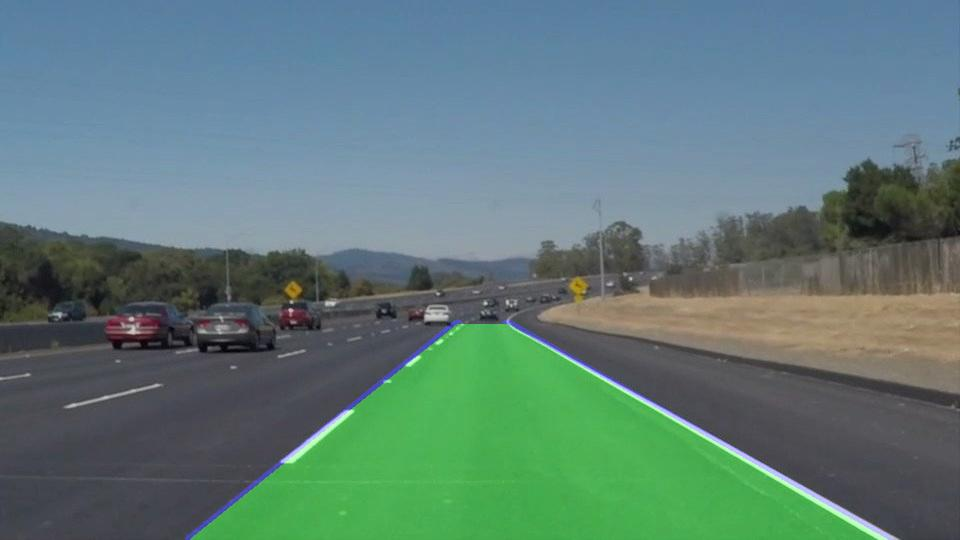
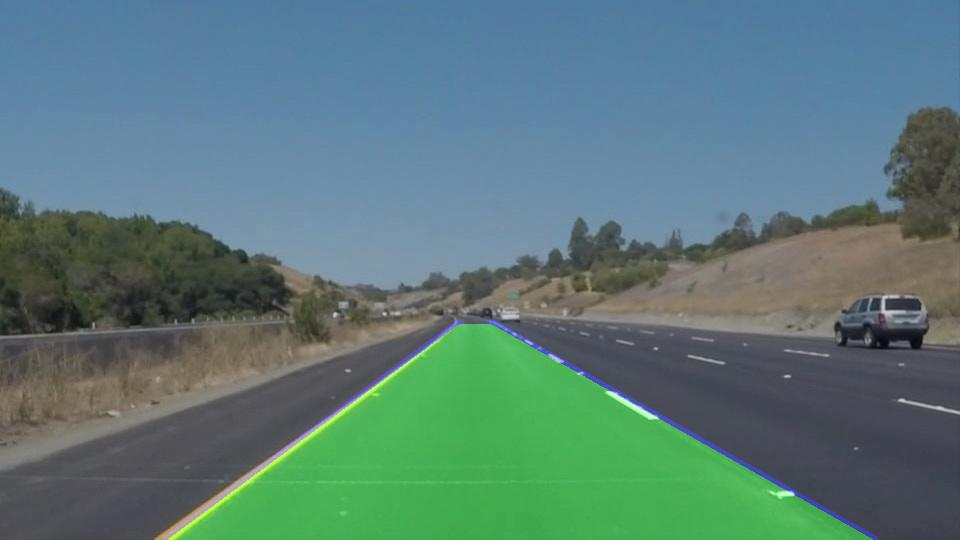

# 🚗 Lane Detection Project

This project implements a lane detection system using computer vision and deep learning, ideal for real-time applications like Advanced Driver Assistance Systems (ADAS) and autonomous driving.

---

## 📚 Table of Contents

- [🎯 Introduction](#introduction)
- [✨ Features](#features)
- [⚙️ Installation](#installation)
- [🚀 Usage](#usage)
- [🧩 Configuration](#configuration)
- [🖼️ Examples](#examples)
- [🤝 Contributing](#contributing)
- [📜 License](#license)
- [📬 Contact](#contact)

---

## 🎯 Introduction

Lane detection plays a critical role in autonomous vehicle navigation. This project focuses on identifying lane boundaries in both images and videos using a combination of traditional vision techniques and deep learning models.

---

## ✨ Features

- ✅ Detects lane boundaries in images and videos
- ⏱️ Real-time lane detection support
- 📊 Visual overlays of detected lanes
- 🔄 Detects both straight and curved lanes
- 🧠 Utilizes deep learning for higher accuracy
- 📈 Logs training and evaluation metrics

---

## ⚙️ Installation

### 1. Clone the repository:

```bash
git clone https://github.com/ninjacode911/ninjacode911-Project-Road-Lane-Detection-System.git
cd ninjacode911-Project-Road-Lane-Detection-System
```

2. Install dependencies:

    ```bash
    pip install -r requirements.txt
    ```

3. Run the application:

    ```bash
    python app/main.py
    ```

    ```bash
    model/model.ipynb
    ```
## Usage

You can test the system with either images or videos using the following modes:

🖼️ Image Processing:

1] Place test images in: notebooks/test_images/

2] Run the Jupyter Notebook or Colab script.

3] Output will be saved in: notebooks/outputs/

🎥 Video Processing:

1] Place test videos in: models/testing/

2] Run the Jupyter Notebook or Colab script.

3] Processed videos will appear in: models/videos/ or models/output/

Direct Python Execution:


1] Place test files in:

2] data/test_images/ for images

3] data/test_videos/ for videos

2. Run:
   python app/main.py
   
Outputs will be stored in the results/ folder.

Note: ✏️ Make sure to update the image/video file names in app/main.py or notebook cells before running.


🧩 Configuration

All configuration files are located in the config/ folder:

environment.yml – Conda environment setup

parameters.json – Customizable parameters for the lane detection pipeline


### Images

Here are some examples of lane detection on input images:






